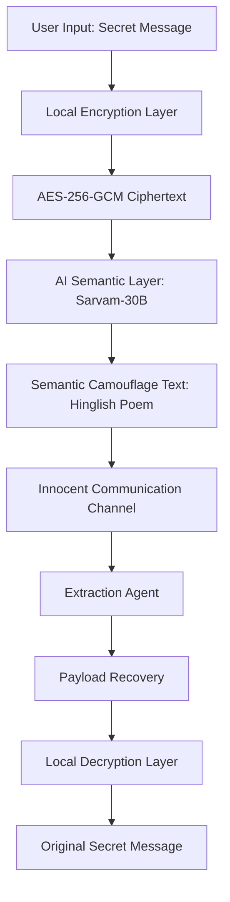

# System Architecture: Vachana-Crypt

This document explains the high-end technical architecture of **Vachana-Crypt**, focusing on how it achieves "Semantic Camouflage" using AI and Cryptography.

## 1. High-Level Workflow

The system operates on a dual-layer security model:

---

## 2. The Encryption Layer (Local Vault)
Vachana-Crypt uses **AES-256-GCM** (Galois/Counter Mode), which is the industry standard for authenticated encryption.

- **Key Derivation:** We use **PBKDF2** with 100,000 iterations of SHA-256 and a 16-byte random salt to derive the 32-byte key from the user's password.
- **Payload Construction:** The resulting payload is a concatenation of `Salt + Nonce + Ciphertext`, which is then Base64 encoded. This ensures the payload is a portable string that the AI can handle.
- **Zero-Knowledge AI:** The Sarvam-30B model never sees the original message. It only sees the encrypted Base64 string, making the system "Zero-Knowledge" regarding the secret content.

## 3. The AI Layer (Semantic Camouflage)
This is where the "High-End" innovation happens. Instead of sending raw ciphertext, we use the **Sarvam-30B** Large Language Model to perform **Semantic Steganography**.

- **Prompt Engineering:** The LLM is instructed to act as a "Camouflage Agent." It takes the Base64 payload and weaves it into a natural-sounding literary piece.
- **Hinglish Advantage:** By using a mix of Hindi and English, the camouflage leverages the complexity of code-mixed languages, making it significantly harder for standard automated traffic analysis tools to detect as an encrypted payload.
- **Deterministic Anchoring:** The system uses specific markers (`VACHANA:` and `:SHASTRY`) and sophisticated regex patterns to ensure that the payload can be extracted perfectly by the authorized receiver.

## 4. Communication Protocol
The system follows a Client-Server architecture:

- **Frontend (React/Vite):** Handles user interaction and displays the visual "Neural Pulse" during AI processing.
- **Backend (FastAPI):** Orchestrates the local crypto functions and the secure handshake with the Sarvam AI Cloud.
- **Security Protocols:** 
    - **CORS Restricted:** Backend is configured to only accept requests from the authorized frontend.
    - **Environment Isolation:** Sensitive API keys are stored in `.env` files and never exposed to the client-side browser.

---

## 5. Security Analysis
- **Resilience to DPI (Deep Packet Inspection):** Since the traffic looks like a standard LLM conversation about philosophy or tech, it bypasses traditional signature-based security filters.
- **Brute Force Resistance:** Even if the camouflage is "broken," the attacker still faces an AES-256-GCM barrier with a high-iteration PBKDF2 key derivation.
